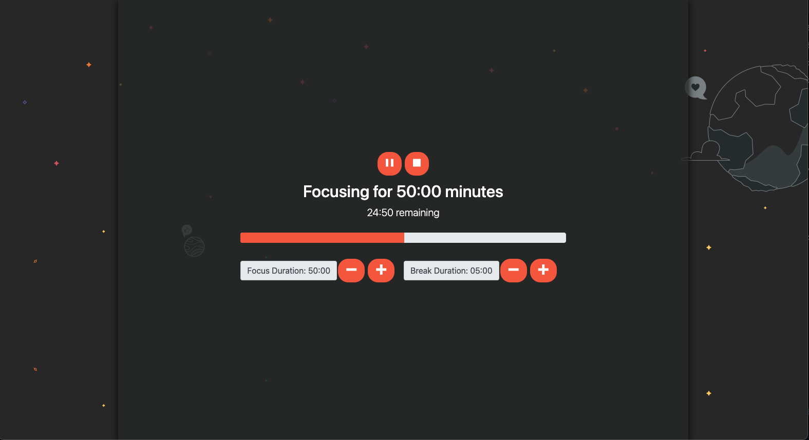

# Local Library

> Link to live app: https://awesome-franklin-363254.netlify.app/

### Overview

**Pomodoro Timer** 
This app was designed to allow users to set a focus/study timer for a certain amount of time and then remind the user when that time is up and then proceeds to start the break timer.

### Dashboard

The main dashboard displays the timer. There are 2 buttons. The first button allows the user to select a study duration time. The second button allows the user to set a duration for break time.
When the study time has come to an end, it will notify the user by playing a ping MP4.

### Technologies Used

- Javascript
- React
- HTML
- CSS
- Bootstrap
- Netlify

